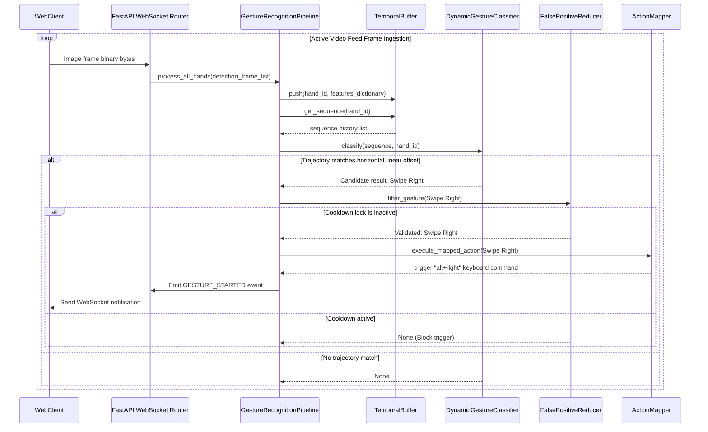

# VisionCanvas AI: Gesture Recognition SDK Documentation

The **Gesture Recognition Engine** sits directly on top of the Hand Tracking Engine, analyzing skeletal coordinate structures over a sliding temporal sequence to recognize static poses, dynamic strokes, multi-hand operations, and custom trained user profiles.

---

## 1. Pipeline Architecture

```
                                +------------------------------+
                                |  HandDetectionFrame Stream   |
                                +--------------+---------------+
                                               |
                                               v
                                +--------------+---------------+
                                |       FeatureExtractor       |
                                |   (Angles, velocities, gaps) |
                                +--------------+---------------+
                                               |
                                               v
                                +--------------+---------------+
                                |        TemporalBuffer        |
                                |   (Sliding window queues)    |
                                +--------------+---------------+
                                               |
                   +---------------------------+---------------------------+
                   | (Static Frame features)   | (Sequence trajectory data)|
                   v                           v                           v
      +------------+------------+ +------------+------------+ +------------+------------+
      |  StaticGestureClassifier | | DynamicGestureClassifier | |    CustomGestureManager    |
      +------------+------------+ +------------+------------+ +------------+------------+
                   |                           |                           |
                   +---------------------------+---------------------------+
                                               | (Raw classification envelope)
                                               v
                                +--------------+---------------+
                                |     FalsePositiveReducer     |
                                |  (Debounce & Cooldown locks) |
                                +--------------+---------------+
                                               |
                                               v
                                +--------------+---------------+
                                |        ActionMapper          |
                                |     (Shortcut command runs)  |
                                +--------------+---------------+
```

---

## 2. Sequence Diagram (Dynamic Swipe Recognition)



---

## 3. Public API Documentation

### WebSocket Gateway Inferences: `/ws/tracking`
Ingests camera images, returns hand landmarks tracking array along with recognized gestures list:
```json
{
  "hands": [...],
  "gestures": [
    {
      "gesture_name": "Swipe Left",
      "confidence": 0.90,
      "duration": 0.48,
      "hand_id": 0,
      "timestamp": 1784310661.0,
      "tracking_quality": 0.95
    }
  ],
  "timestamp": 1784310661.0
}
```

### Event Messaging Gateway: `/ws/events`
Websocket channel piping state updates:
```json
{
  "event_id": "bfd39763-7182-411a-ab93-19eb763b01a2",
  "event_type": "GESTURE_STARTED",
  "gesture_name": "Swipe Left",
  "hand_id": 0,
  "confidence": 0.90,
  "timestamp": 1784310661.0,
  "metadata": null
}
```

---

## 4. Custom Gestures Profile Guide

To record and register a custom trajectory profile:
1.  Initialize recording channel:
    `custom_manager.start_recording(user_id="user_123", name="MyCustomHeart")`
2.  During drawing loops, pipe landmarks coordinates to recorder:
    `custom_manager.record_frame("user_123", landmarks_list)`
3.  Save template profile:
    `custom_manager.save_recording("user_123")`
    The gesture trajectory is normalized by subtracting the wrist centroid coordinate at each keyframe and written to `custom_gestures.json`.
