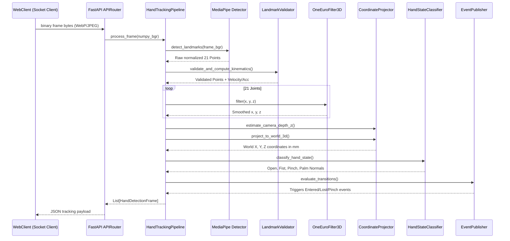

# VisionCanvas AI: Hand Tracking SDK Documentation

The **Hand Tracking Engine** serves as the spatial computing core input capture module for VisionCanvas AI. It processes BGR video frames, parses landmarks, reduces noise via One Euro adaptive smoothing, calculates joint coordinates, detects postures (pinch, pointing, fist), and maps them into kinematic variables.

---

## 1. System Architecture

```
                                +---------------------------+
                                |    Numpy OpenCV Frame     |
                                +-------------+-------------+
                                              |
                                              v
                                +-------------+-------------+
                                |    HandDetector Service   |
                                |    (MediaPipe Wrapper)    |
                                +-------------+-------------+
                                              |
                                              v
                                +-------------+-------------+
                                |     LandmarkValidator     |
                                |  (Kinematic & Occlusion)  |
                                +-------------+-------------+
                                              |
                                              v
                                +-------------+-------------+
                                |      TemporalFilter       |
                                |     (One Euro Filter)     |
                                +-------------+-------------+
                                              |
                                              v
                                +-------------+-------------+
                                |    CoordinateProjector    |
                                |   (Camera / World / Scr)  |
                                +-------------+-------------+
                                              |
                                              v
                                +-------------+-------------+
                                |    HandStateClassifier    |
                                |   (Posture & Palm Vector) |
                                +-------------+-------------+
                                              |
                                              v
                                +-------------+-------------+
                                |     EventPublisher        |
                                +-------------+-------------+
```

---

## 2. Sequence Diagram (Frame Processing Loop)



---

## 3. Public API Documentation

### WebSocket Ingestion Endpoint: `ws://localhost:8000/api/v1/ws/tracking`
*   **Ingestion Format**: Raw image bytes (JPEG, WebP).
*   **Response payload format**:
```json
{
  "hands": [
    {
      "hand_id": 0,
      "label": "Right",
      "confidence_score": 0.98,
      "landmarks": [
        {
          "x": 10.5,
          "y": -20.4,
          "z": 1000.0,
          "visibility": 1.0,
          "confidence": 0.98,
          "velocity_x": 0.5,
          "velocity_y": 0.0,
          "velocity_z": 0.0,
          "acceleration_x": 0.0,
          "acceleration_y": 0.0,
          "acceleration_z": 0.0,
          "timestamp": 1784310661.0
        }
      ],
      "state": {
        "is_open": false,
        "is_fist": false,
        "is_pointing": true,
        "is_pinching": false,
        "pinch_distance_mm": 80.5,
        "palm_direction": { "x": 0.0, "y": 0.0, "z": -1.0 },
        "wrist_orientation_deg": 12.5
      },
      "timestamp": 1784310661.0
    }
  ],
  "timestamp": 1784310661.0
}
```

### Event Streaming Endpoint: `ws://localhost:8000/api/v1/ws/events`
Exposes hand presence changes (e.g. `HAND_ENTERED`, `HAND_LOST`) and pose gestures triggers (e.g. `FINGER_PINCHED`).

---

## 4. Extension Guide

To extend the Hand State system with custom poses (e.g. "Thumbs Up", "Victory Sign"):
1.  Add the new boolean state indicators to `HandState` inside [models.py](file:///c:/Users/pc/OneDrive/Desktop/Air%20canvas/apps/ai-service/app/services/hand_tracking/models.py).
2.  Open [state.py](file:///c:/Users/pc/OneDrive/Desktop/Air%20canvas/apps/ai-service/app/services/hand_tracking/state.py).
3.  Add custom angle calculation checks. Check if target finger configurations are met:
```python
# Check for Thumbs Up posture
is_thumb_extended = self._get_distance_mm(thumb_tip, index_mcp) > threshold
is_others_folded = not (index_extended or middle_extended or ring_extended or pinky_extended)
is_thumbs_up = is_thumb_extended and is_others_folded and palm_direction.y > 0
```
4.  Return the custom indicators mapping inside `classify_hand_state`.
