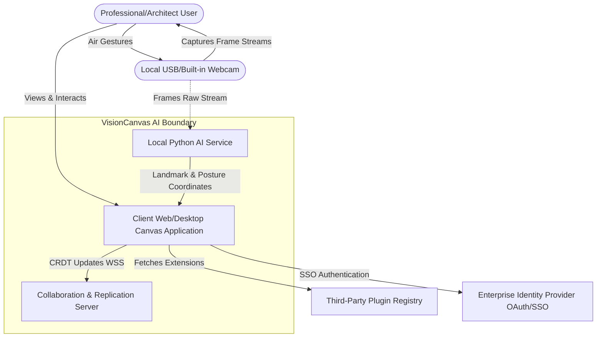
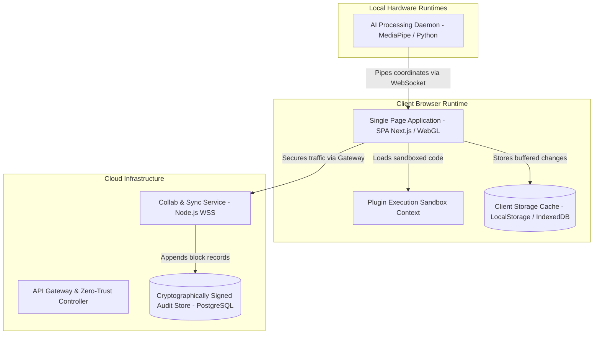
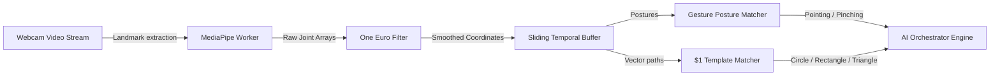
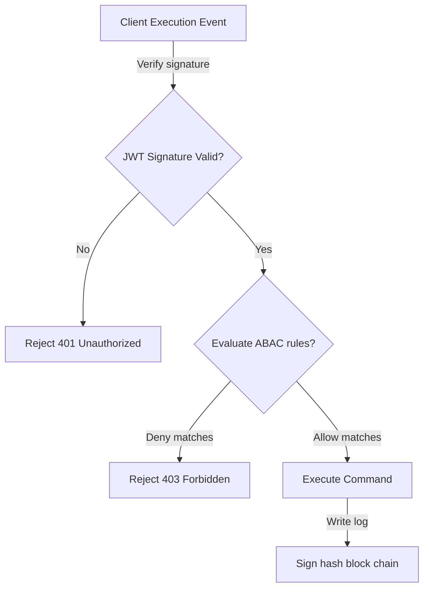
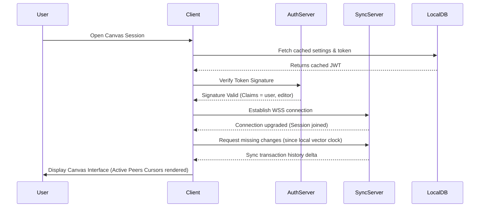

# VisionCanvas AI: Complete System Architecture Specification

---

## 1. System Context Diagram

The System Context defines the high-level boundary of VisionCanvas AI, detailing how the target user interacts with the camera, the client canvas, local AI model workers, and backend collaborative databases.



---

## 2. Container Diagram

The Container Diagram zooms into the system boundary, showing the high-level software containers (logical runtimes), their tech stacks, and how they communicate.



---

## 3. Component Diagram

The Component Diagram breaks down the inner workings of the `packages/` monorepo libraries.

```mermaid
graph TD
    subgraph @visioncanvas Workspace packages
        Orchestrator[AI Orchestrator]
        Renderer[WebGL Hierarchical Renderer]
        DrawingEngine[Air Drawing Engine]
        Collaboration[CRDT Collaboration Engine]
        Security[Zero-Trust Security Manager]
        OfflineSync[Cloud Sync & Offline-First Platform]
        PluginSDK[Plugin SDK sandbox]
    end

    Orchestrator -->|Schedules inference outputs| DrawingEngine
    DrawingEngine -->|Pipes vector nodes| Renderer
    DrawingEngine -->|Appends history commands| Collaboration
    Collaboration -->|Saves state log| OfflineSync
    OfflineSync -->|Validates cache checksums| Security
    PluginSDK -->|Proxies modifications| DrawingEngine
```

---

## 4. Deployment Diagram

The Deployment Diagram details the multi-target executable layout.

```mermaid
flowchart TD
    subgraph Client Machine Deployment
        subgraph Web Browser Sandbox
            BrowserBundle[Next.js Static Build Bundle]
            IndexedDB[(Local Disk Cache)]
        end
        subgraph Desktop Installer (Windows/macOS/Linux)
            ElectronApp[Electron Container Wrapper]
            LocalPython[Embedded Python Runtime Environment]
        end
    end
    
    subgraph Cloud Container Deployment
        K8sCluster[Kubernetes Cluster Pods]
        DBInstance[(Managed PostgreSQL Instance)]
    end

    BrowserBundle -->|Persists locally| IndexedDB
    ElectronApp -->|Orchestrates| LocalPython
    ElectronApp -->|Syncs state via TLS| K8sCluster
    K8sCluster -->|Commits audited operations| DBInstance
```

---

## 5. Runtime Diagram

The Runtime Diagram maps process lifetimes and thread bindings during runtime execution loops.

```
+---------------------------------------------------------------------------------+
|                                 Client Machine                                  |
|                                                                                 |
|  +---------------------------+              +--------------------------------+  |
|  |       Renderer Loop       |              |        AI Worker Daemon        |  |
|  |    (requestAnimationFrame) |              |      (Separate OS Process)     |  |
|  |                           |              |                                |  |
|  |  1. Read local state      |              |  1. Ingest camera raw frame    |  |
|  |  2. Calculate VFX physics |              |  2. MediaPipe landmark search  |  |
|  |  3. Render 3D Scene Graph |              |  3. One Euro coordinate filter |  |
|  |  4. Flush GPU buffers     |              |  4. Classify gesture posture   |  |
|  |                           |              |  5. Write coordinates to socket|  |
|  +-------------^-------------+              +---------------+----------------+  |
|                |                                            |                   |
|                +----------- Coordinates JSON <--------------+                   |
|                                                                                 |
+---------------------------------------------------------------------------------+
```

---

## 6. Network Diagram

The Network Diagram details protocol selections, load balancer placement, and firewalls.

```
 [User Client App] 
        |
        | WSS / HTTPS (TLS 1.3 on Port 443)
        v
 [Cloudflare Edge Load Balancer] 
        |
        | Scoped Private Subnet Routing
        v
 [Kubernetes Ingress Gateway] ---> [Rate Limiting Guard] ---> [Zero-Trust Gating Node]
        |
        +---------------------------> [Node.js Sync Pods]
```

---

## 7. Data Flow Diagram

The Data Flow Diagram traces data transformation from raw pixels to structured diagrams.

```
[Raw Camera Video Frame] 
      │
      ▼ (MediaPipe Landmarks Tracking)
[Normalized 21 Joint Coordinates Mapping]
      │
      ▼ (One Euro Smoothing Filter)
[Jitter-Free Pixel Screen Projections]
      │
      ▼ (Shoelace Area & Shoelace Perimeters Feature Extraction)
[Classified Diagram Shapes (Confidence > 0.85)]
      │
      ▼ (Snapping & Connectors Anchor Layout Engine)
[Editable SVG/LaTeX Diagram Output Layers]
```

---

## 8. AI Pipeline Diagram

Details data flow through the AI modules:



---

## 9. Plugin Sandbox Architecture

Plugins run in a sandboxed execution context to prevent malicious scripts from accessing internal resources or user data.

```
 +---------------------------------------------------------------------------+
 |                              Client Browser                               |
 |                                                                           |
 |  +---------------------------------------------------------------------+  |
 |  |  Web Worker Sandbox Container                                       |  |
 |  |                                                                     |  |
 |  |    +--------------------+       Restricted APIs                     |  |
 |  |    | Third-Party Script | -----( Gated Access Proxy )               |  |
 |  |    +--------------------+                     |                     |  |
 |  +-----------------------------------------------|---------------------+  |
 |                                                  v                        |
 |                                      +-----------------------+            |
 |                                      | Core API Loader       |            |
 |                                      | (Verifies permissions)|            |
 |                                      +-----------------------+            |
 +---------------------------------------------------------------------------+
```

---

## 10. Security Architecture



---

## 11. Cloud Architecture

*   **API Gateways**: Manages security validation hooks and rate limiting.
*   **Websocket Nodes**: Tracks real-time presence cursor coordinates and broadcasts messages.
*   **Audit Database**: Stores transactional history blocks with SHA256 integrity checks.

---

## 12. Offline Architecture

```
                      +-----------------------------+
                      |     Client Canvas Memory    |
                      +--------------+--------------+
                                     |
                       Offline Event | Connection Offline
                                     v
                      +--------------+--------------+
                      |   Local Storage Checksums   |
                      |  (DJB2 hash integrity validation) |
                      +--------------+--------------+
                                     |
                        Reconnect    | Online Event
                                     v
                      +--------------+--------------+
                      |      Replication Engine     |
                      | (Pushes local changes delta)|
                      +-----------------------------+
```

---

## 13. Rendering Pipeline

The rendering system runs on a frame budget loop:
1.  **Frame Trigger**: High-precision timers trigger rendering checks.
2.  **Scene Graph Traversal**: Computes global matrices recursively down the node hierarchy.
3.  **Culling Pass**: Rejects nodes outside the viewport boundary.
4.  **Geometry Drawing Pass**: Binds vertex shaders to buffer structures and draws vector paths.
5.  **Post-Process Glow Pass**: Applies bloom, glow, and neon effects.
6.  **Debug Monitor Pass**: Draws rendering statistics (FPS, latency, draw calls).

---

## 14. CRDT Synchronization Pipeline

Synchronization is lock-free and resolves conflicts automatically:
1.  **Operation Captured**: Local stroke coordinates or layer changes are saved to an event payload.
2.  **Vector Clock Updates**: The event is stamped with a local clock iteration count.
3.  **Local Append**: The change applies locally immediately to prevent lag.
4.  **Remote Broadcast**: The payload is sent to peers via WebSocket channels.
5.  **Remote Integration**: Peers receive the payload, compare vector clocks, and run LWW rules to resolve any overlapping changes.

---

## 15. Sequence Diagrams: Loading a Canvas Session



---

## 16. Dependency Graphs

```
                   @visioncanvas/web (Next.js Application)
                     │
                     ├──> @visioncanvas/ai-orchestrator
                     │     └──> @visioncanvas/types
                     │
                     ├──> @visioncanvas/collaboration
                     │     └──> @visioncanvas/types
                     │
                     └──> @visioncanvas/drawing-engine
                           ├──> @visioncanvas/renderer
                           └──> @visioncanvas/vfx
```

---

## 17. Technology Stack

*   **Core Languages**: TypeScript, Python.
*   **Web Rendering**: HTML5 Canvas, WebGL, Next.js.
*   **AI Inference**: MediaPipe (landmarks tracking), Python (One Euro filters).
*   **Unit & Integration Testing**: Vitest, Pytest.
*   **CI/CD tooling**: Turbo (caching build workflows), PNPM (workspace linkers).

---

## 18. Scaling Strategy

*   **Websocket Clustering**: Use Redis adapters to distribute room messages across multiple application server instances.
*   **Client-Side Offloading**: Process hand tracking, filters, and gesture recognition on the client machine to reduce backend compute requirements.

---

## 19. Failure Recovery

*   **Safe Mode**: Launches the application with third-party plugins disabled if a crash is detected during startup.
*   **Offline Fallback**: Continues executing draw calls and gesture recognition locally if the connection drops.

---

## 20. Disaster Recovery

*   **Dynamic Client Fallbacks**: The client automatically reconnects and tries alternative backend gateways if a primary server crashes.
*   **Database Recovery**: Restores the transaction history by replaying the signed, chained audit logs.
