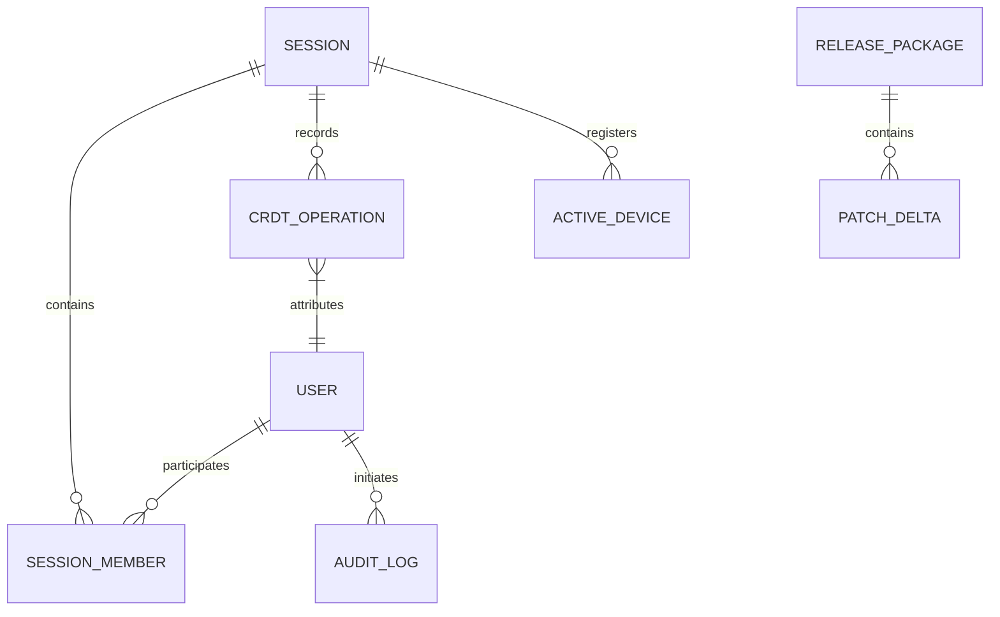

# VisionCanvas AI: Enterprise Data Architecture
## Schema Specifications, Storage Layouts & Lifecycle Rules

---

## 1. Entity Relationship (ER) Diagram

The data model matches users, sessions, local storage offline edits, published releases, and audit logs.



---

## 2. Entity Schemas & Indexing Definitions

### 2.1 USER
*   **Description**: Stores identity profiles and role access variables.
*   **Schema**:
    *   `id`: `UUID` (Primary Key)
    *   `email`: `VARCHAR(255)` (Unique, Not Null)
    *   `password_hash`: `VARCHAR(255)` (Not Null)
    *   `roles`: `VARCHAR(64)[]` (Not Null)
    *   `attributes`: `JSONB` (Stores country, clearance indicators)
*   **Indexes**:
    *   `idx_user_email`: Unique B-Tree index on `email`.

### 2.2 SESSION
*   **Description**: Collaborative canvas workspace instance.
*   **Schema**:
    *   `id`: `UUID` (Primary Key)
    *   `owner_id`: `UUID` (Foreign Key -> USER.id)
    *   `title`: `VARCHAR(255)` (Not Null)
    *   `created_at`: `TIMESTAMP` (Not Null)
*   **Indexes**:
    *   `idx_session_owner`: B-Tree index on `owner_id`.

### 2.3 CRDT_OPERATION
*   **Description**: Serialized event-log command elements for lock-free session merges.
*   **Schema**:
    *   `id`: `UUID` (Primary Key)
    *   `session_id`: `UUID` (Foreign Key -> SESSION.id, Cascade Delete)
    *   `actor_id`: `UUID` (Foreign Key -> USER.id)
    *   `vector_clock`: `BIGINT` (Not Null)
    *   `operation_type`: `VARCHAR(64)` (e.g. `draw`, `delete`, `update_layer`)
    *   `payload`: `JSONB` (Not Null)
*   **Indexes**:
    *   `idx_crdt_session_clock`: Composite B-Tree index on `(session_id, vector_clock)`.

### 2.4 AUDIT_LOG
*   **Description**: Tamper-proof, SHA256-chained access logs.
*   **Schema**:
    *   `id`: `UUID` (Primary Key)
    *   `timestamp`: `BIGINT` (Not Null)
    *   `event`: `VARCHAR(128)` (Not Null)
    *   `actor_id`: `UUID` (Not Null)
    *   `result`: `VARCHAR(32)` (e.g., `allow`, `deny`)
    *   `previous_hash`: `VARCHAR(64)` (Not Null)
    *   `hash`: `VARCHAR(64)` (Not Null)
*   **Indexes**:
    *   `idx_audit_hash_chain`: B-Tree index on `(timestamp, hash)`.

---

## 3. Storage Layout & Data Cache Layer

```
                        +----------------------------+
                        |      In-Memory Cache       |
                        |      (Vector Clock Maps)   |
                        +-------------+--------------+
                                      |
                        Flush Changes | (Every 60 seconds)
                                      v
                        +-------------+--------------+
                        |      Local Disk Storage    |
                        |    (DJB2 check validation) |
                        +-------------+--------------+
                                      |
                       Upload Changes | (Replication Engine)
                                      v
                        +-------------+--------------+
                        |      Relational DB         |
                        |   (Audit logs, CRDT piles) |
                        +----------------------------+
```

---

## 4. Metadata Formats

### 4.1 Sync Metadata
Every synchronization event includes local clock boundaries:
```json
{
  "vectorClock": 1054,
  "clientTimestamp": 1784909200,
  "clientSignature": "sig-checksum-signed"
}
```

### 4.2 AI Model Benchmark Metadata
Logged precision metrics for diagram shape matches:
```json
{
  "modelId": "shape-dollar-v1",
  "confidenceScore": 0.94,
  "classificationResult": "rectangle",
  "latencyMs": 8.4
}
```

---

## 5. Retention Policies & Lifecycle Rules

*   **Temporary Guest Sessions**: Deleted 24 hours after session termination.
*   **Audit Platform Logs**: Hard-locked for 7 years to meet compliance standards; cannot be modified or deleted.
*   **Auto-Save Drafts**: Kept in local client cache for up to 30 days before automatic deletion.

---

## 6. Migration Strategy

1.  **State Schema Versioning**: Every schema update must include a `version` identifier and matching forward/rollback scripts.
2.  **No-Downtime Releases**: Run database updates in two steps: first apply columns as nullable, then migrate data, and finally apply strict validation constraints.
