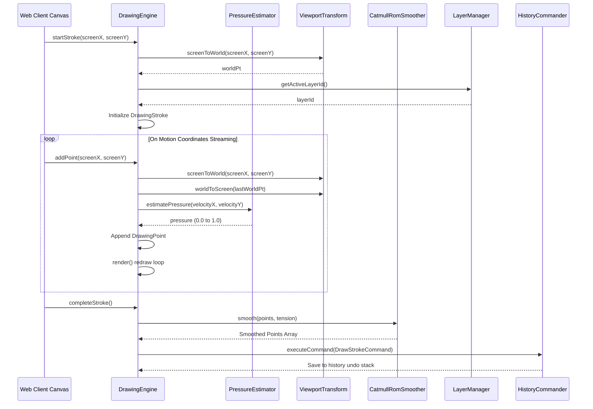

# VisionCanvas AI: Air Drawing SDK Documentation

The **Air Drawing Engine** (`@visioncanvas/drawing-engine`) acts as the high-performance visual rendering foundation for VisionCanvas AI. It transforms spatial coordinates streams from hand tracking and gesture signals into vector-based brush dynamics, overlays, and multi-layer layouts.

---

## 1. System Architecture

```
                       +-----------------------------------+
                       |    Gesture Tracker Coordinates    |
                       +-----------------+-----------------+
                                         |
                                         v
                       +-----------------+-----------------+
                       |        PressureEstimator          |
                       +-----------------+-----------------+
                                         | (Point + Pressure)
                                         v
                       +-----------------+-----------------+
                       |         SmoothingPipeline         |
                       | (Bezier / Catmull-Rom / Chaikin)  |
                       +-----------------+-----------------+
                                         |
                                         v
                       +-----------------+-----------------+
                       |           BrushEngine             |
                       |  (Pen, Calligraphy, Neon, Eraser) |
                       +-----------------+-----------------+
                                         |
                                         v
                       +-----------------+-----------------+
                       |           LayerManager            |
                       +-----------------+-----------------+
                                         |
                                         v
                       +-----------------+-----------------+
                       |        ViewportTransform          |
                       |       (Pan, Zoom, Snaps)          |
                       +-----------------+-----------------+
                                         |
                                         v
                       +-----------------+-----------------+
                       |    HTML5 Canvas 2D Context        |
                       +-----------------------------------+
```

---

## 2. Sequence Diagram (Point Ingestion Flow)



---

## 3. Public APIs

### Class: `DrawingEngine`

*   `setCanvas(canvas: HTMLCanvasElement): void`
    Binds the rendering engine to the DOM canvas context.
*   `startStroke(screenX: number, screenY: number, screenZ?: number): void`
    Begins coordinates ingestion for active drawing actions.
*   `addPoint(screenX: number, screenY: number, screenZ?: number): void`
    Appends moving cursor vectors, estimates speed pressure, and triggers canvas redraws.
*   `completeStroke(): void`
    Finalizes the stroke, applies smoothing splines, and registers the command to history.
*   `undo(): void`
    Reverts the last drawn stroke or layer state change.
*   `redo(): void`
    Re-applies the last reverted command.
*   `clear(): void`
    Resets the canvas viewport, clears all strokes, and resets layers.

### Class: `HistoryCommander`

*   `executeCommand(command: HistoryCommand): void`
    Executes the command. If a transaction is active, groups it within the transaction; otherwise, commits it directly to the undo stack and evicts older commands beyond `maxHistorySize`.
*   `undo() / redo(): void`
    Reverts or re-applies the last history action.
*   `startTransaction(): void`
    Begins grouping consecutive commands into an atomic macro block.
*   `endTransaction(): void`
    Groups all executed commands inside the active transaction into a single `MacroCommand` and commits it to the history stack.
*   `rollbackTransaction(): void`
    Rolls back (calls `undo` on) all uncommitted commands within the active transaction and discards them.

### Class: `StrokeService`

*   `startStroke(strokeId: string, layerId: string, brushConfig: any, initialPoint: DrawingPoint): DrawingStroke`
    Starts building a new stroke segment and returns the initialized stroke object.
*   `addPoint(point: DrawingPoint): DrawingStroke | null`
    Appends a new point, applying configurable time and distance density filters. Returns the updated stroke, or null if filtered.
*   `completeStroke(): DrawingStroke | null`
    Finalizes the active stroke, resets tracking state, and returns the committed stroke.
*   `cancelStroke(): void`
    Cancels/interrupts the active stroke, discarding all collected points in this segment.
*   `getActiveStroke(): DrawingStroke | null`
    Gets the current active stroke state, safely cloned.

### Class: `SmoothingService`

*   `smooth(points: DrawingPoint[]): DrawingPoint[]`
    Applies Bezier interpolation or Catmull-Rom splines to smooth path coordinates. If configured, partitions paths at sharp corner angles (`cornerAngleThreshold`) to prevent corner rounding.

### Class: `ViewportTransform`

*   `pan(dx: number, dy: number): void`
    Pans the infinite canvas. Clamps pan offsets to virtual canvas bounds if configured.
*   `zoomAt(anchorX: number, anchorY: number, factor: number): void`
    Zooms the infinite canvas relative to an anchor coordinate (e.g. cursor point). Clamps zoom/pan offsets to virtual bounds if configured.
*   `resize(width: number, height: number, dpr?: number): void`
    Updates dimensions and dpr configuration. Resizes high DPI elements appropriately.
*   `screenToWorld(screenX: number, screenY: number): { x: number; y: number }`
    Transforms screen space pointer coordinates to infinite canvas world space.
*   `worldToScreen(worldX: number, worldY: number): { x: number; y: number }`
    Projects world coordinates back onto rendering screen coordinates.
*   `setBounds(bounds: ViewportBounds | null): void`
    Configures virtual canvas bounds boundaries to restrict pan/zoom.

### Class: `GestureDrawingBridge`

*   `start(): void`
    Starts listening to hand tracking landmark updates and gesture events. Starts drawing automatically when the configured gesture starts, and moves coordinates as the hand moves.
*   `stop(): void`
    Stops listening, cleans up subscriptions, and cleanly completes any active drawing strokes.

---

## 4. Brush Customization Guide

All brushes extend the abstract [BaseBrush](file:///c:/Users/pc/OneDrive/Desktop/Air%20canvas/packages/drawing-engine/src/brush/base.ts) interface. To write a custom brush:
1.  Extend `BaseBrush` class.
2.  Override `drawSegment` method.
3.  Utilize `this.applyCanvasStrokeStyle` to set pressure-aware stroke weights.
4.  Register the new brush in [BrushManager](file:///c:/Users/pc/OneDrive/Desktop/Air%20canvas/packages/drawing-engine/src/brush/index.ts).

Example:
```typescript
import { BaseBrush, DrawingPoint } from "@visioncanvas/drawing-engine";

export class DashBrush extends BaseBrush {
  public drawSegment(ctx: CanvasRenderingContext2D, p0: DrawingPoint, p1: DrawingPoint): void {
    ctx.beginPath();
    this.applyCanvasStrokeStyle(ctx, p1);
    ctx.setLineDash([5, 10]); // Custom dash array
    ctx.moveTo(p0.x, p0.y);
    ctx.lineTo(p1.x, p1.y);
    ctx.stroke();
    ctx.setLineDash([]); // Reset
  }
}
```

---

## 5. Performance Optimizations

*   **Double Buffering / Offscreen Render Cache**: The engine maintains an offscreen canvas rendering cache. When completed strokes are modified, layers properties change, or viewport parameters shift (pan, zoom, scale), the background cache is rendered. Active real-time updates blit this cached background canvas image in a single $O(1)$ call, rendering only the active stroke's segments on top to sustain smooth 60/120 FPS frame rates.
*   **Object Pooling**: Avoids Garbage Collection pauses and heap allocation overhead in drawing loops by using pre-allocated, recycled `DrawingPoint` objects in segment coordinates projection and path smoothing.
*   **Frustum Culling**: Discards segments outside the canvas viewport before execution of brush rasterizer methods.

