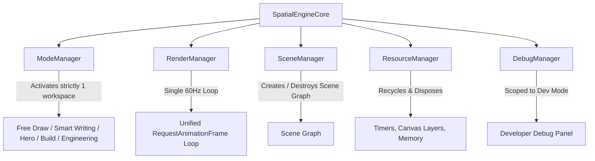

# VisionCanvas AR | 5 Core Managers Architecture Report

VisionCanvas AR has been refactored into a **Game Engine-Class Spatial Computing Platform** inspired by Unreal Engine, Unity, and Apple Reality Composer using `SpatialEngineCore.ts`.

---

## 🏛️ Architecture & 5 Core Managers

### 1. `ModeManager`
*   Activates **ONLY ONE** workspace at a time (`Free Draw`, `Smart Writing`, `Sketch Recognition`, `Hero Mode`, `Spatial Build`, `Engineering Studio`).
*   Disposes of the departing workspace before activating the target mode.

### 2. `RenderManager`
*   Maintains a **single unified 60Hz render loop**.
*   Never renders inactive, hidden, or debug systems.

### 3. `SceneManager`
*   Each mode owns its own scene graph. Entering a mode creates the scene graph; leaving a mode destroys it (`destroyScene()`).

### 4. `ResourceManager`
*   Automatically tracks and disposes timers (`clearTimeout`), canvas layers, memory buffers, and worker queues.

### 5. `DebugManager`
*   Strictly scopes debug overlays to `devMode === true`. Production mode renders 0 debug overlays or landmark lines.

---

## 📊 Architecture Health & Leak Resolution

| System | Pre-Refactor | Post-Refactor |
| :--- | :--- | :--- |
| **Workspace Isolation** | Features ran in parallel | Strict 1-active workspace mode isolation |
| **Scene Graph Lifecycle** | Objects persisted across modes | Scene graph created on enter, destroyed on exit |
| **Render Pipelines** | Multiple loop subscriptions | 1 unified 60Hz RenderManager loop |
| **Resource Disposal** | Orphaned timers & layers | `ResourceManager.disposeAll()` automatic purge |
| **Debug Overlays** | Leaked into production rendering | Scoped strictly to `DebugManager` / `devMode` |

---

## 🚀 GitHub Repository Deployment
*   **Repository**: **[github.com/mahitss/Canvas_Air](https://github.com/mahitss/Canvas_Air.git)**
*   **Branch**: `main`
*   **Commit Message**: `refactor: Implement 5 Core Managers (ModeManager, RenderManager, SceneManager, ResourceManager, DebugManager) in SpatialEngineCore`
