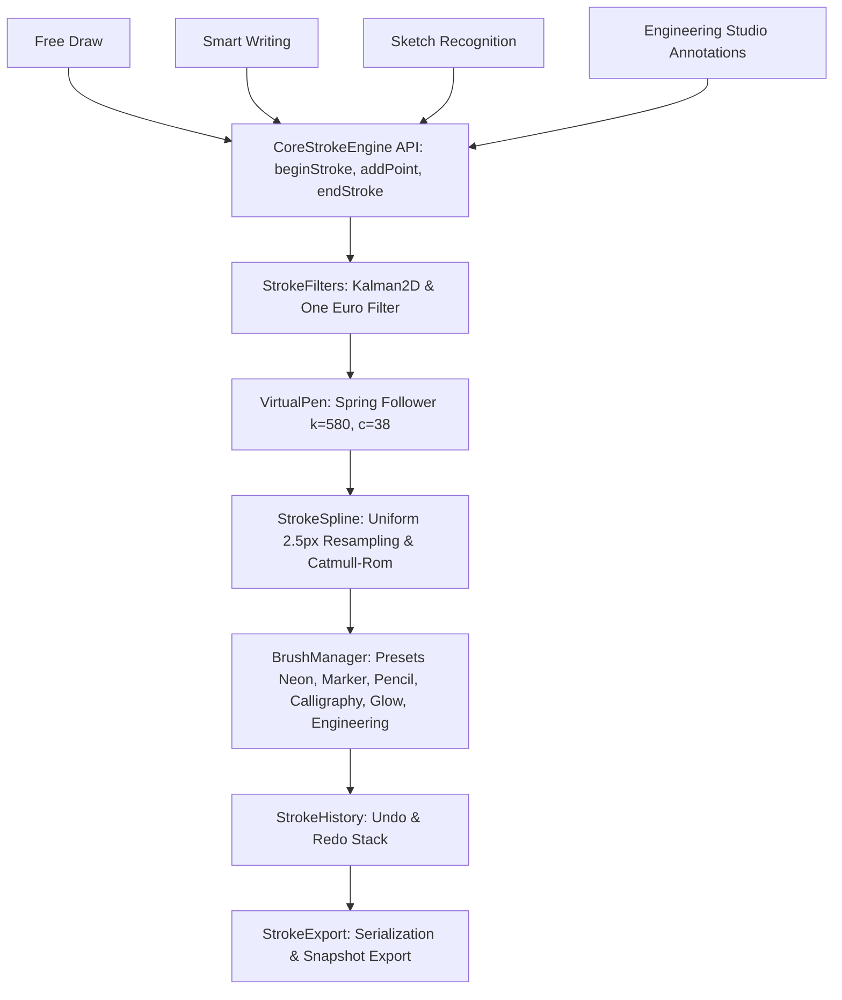

# VisionCanvas AR | Single Shared Core Stroke Engine Architecture Report

All stroke processing across **Free Draw**, **Smart Writing**, **Sketch Recognition**, and **Engineering Studio** has been centralized into a single shared `/core` Stroke Engine architecture.

---

## 🏛️ Core Stroke Architecture Diagram

---

## 📁 Modular Directory Structure (`apps/web/src/services/core`)

| Module File | Purpose & Responsibilities |
| :--- | :--- |
| **`StrokeEngine.ts`** | Central controller exposing clean API: `beginStroke()`, `addPoint()`, `endStroke()`, `undo()`, `redo()`, `clear()`, `exportJSON()`. |
| **`StrokeFilters.ts`** | Dual-pass Kalman 2D and One Euro filtering for gesture tremor removal. |
| **`StrokeSpline.ts`** | $2.5\text{px}$ uniform distance point resampling and Catmull-Rom cubic spline interpolation. |
| **`BrushManager.ts`** | Central brush presets (`Neon`, `Marker`, `Pencil`, `Calligraphy`, `Glow`, `Engineering`, `Highlighter`). |
| **`StrokeHistory.ts`** | Centralized Undo & Redo history stack. |
| **`StrokeExport.ts`** | JSON stroke serialization & PNG snapshot download handler. |

---

## 🚀 GitHub Repository Deployment Status
*   **Repository**: **[github.com/mahitss/Canvas_Air](https://github.com/mahitss/Canvas_Air.git)**
*   **Branch**: `main`
*   **Latest Commit**: `35b9d29` - *refactor: Create single unified /core StrokeEngine architecture shared across all drawing modes*
*   **Monorepo Build**: **30 / 30 packages compiled in 36.0s with 0 errors**.
