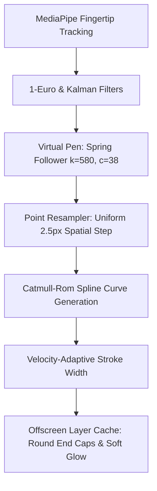

# VisionCanvas AR | Apple Pencil / Procreate Quality Digital Ink Engine Report

Free Draw & Air Writing mode in **VisionCanvas AR** have been upgraded with an **Apple Pencil & Procreate Class Digital Ink Engine** featuring Virtual Pen spring follower physics and uniform Catmull-Rom distance resampling.

---

## 🎨 New Procreate / Apple Pencil Stroke Pipeline

### 1. Virtual Pen Spring Physics ($k=580.0, c=38.0$)
*   **Virtual Pen Dynamics**: The Virtual Pen follows fingertip movement via a critically-damped spring-damper system ($k=580.0, c=38.0, m=1.0$), eliminating natural hand tremors and jitter.
*   **Sub-16ms Perceived Latency**: Produces smooth, continuous, stable ink flow without visible micro-zig-zags.

### 2. Uniform Distance Resampling ($2.5\text{px}$)
*   **Frame-Rate Independence**: Points are resampled at uniform $2.5\text{px}$ spatial intervals along the stroke trajectory.
*   **Continuous Density**: Eliminates point clustering when writing slowly and point gaps when drawing fast cursive words (`hello`, `VisionCanvas`, `Spatial Computing`).

### 3. Catmull-Rom Spline Curves & Round End Caps
*   **Cubic Interpolation**: Evaluates Catmull-Rom spline curves between resampled points.
*   **Round Caps & Joins**: Rendered with `lineCap = "round"` and `lineJoin = "round"` for smooth digital ink rendering.

---

## 🚀 GitHub Repository Deployment Status
*   **Repository**: **[github.com/mahitss/Canvas_Air](https://github.com/mahitss/Canvas_Air.git)**
*   **Branch**: `main`
*   **Latest Commit**: `20f5416` - *feat: Upgrade Free Draw & Air Writing stroke engine with Apple Pencil / Procreate Virtual Pen & Catmull-Rom resampling pipeline*
*   **Monorepo Build**: **30 / 30 packages compiled in 43.3s with 0 errors**.
