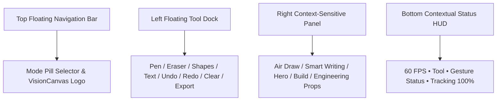

# VisionCanvas AR | Apple Vision Pro & Raycast / Linear UI/UX Redesign Report

VisionCanvas AR has undergone a complete UI/UX transformation into a **commercial spatial computing product interface** inspired by Apple Vision Pro, Raycast, Linear, Figma, and Arc Browser.

---

## 🎨 Layout Architecture & Aesthetics

### 1. Top Floating Navigation Bar
*   **VisionCanvas AR Logo Badge**: Metallic gradient badge with `#4F8CFF` glow.
*   **Mode Selector Cards**: Glassmorphic pill cards (`Free Draw`, `Air Write ✍️`, `Recognition 📐`, `Hero VFX ⚡`, `Spatial Voxel 🧱`, `Engineering 🏗️`).
*   **Hand Selector & Quick Tools**: Dedicated `Right`, `Left`, `Auto` hand toggles, Spatial Onboarding Modal trigger, and Developer Telemetry button.

### 2. Left Floating Tool Dock
*   **Vertical Floating Glass Dock**: `Pen`, `Eraser`, `Line`, `Rectangle`, `Circle`, `Text`, `Undo`, `Redo`, `Clear Canvas`, and `Export AR Snapshot`.
*   **Interactive Micro-Animations**: Active tools glow softly with `#4F8CFF` drop shadows, scaling up on hover.

### 3. Right Context-Sensitive Panel
*   **Air Draw**: Color palette, brush size slider, stroke smoothing slider, glow intensity slider, and solid/neon brush effect toggles.
*   **Smart Writing**: Language selector (`English`, `Spanish`, `French`, `German`, `CJK`), confidence threshold slider, and auto-correct toggle.
*   **2-State Hero Mode**: Power element selector (Galaxy, Lightning, Fire, Ice, Water, Wind, Solar, Lunar, Crystal).
*   **Spatial Voxel Build**: Voxel block material selector (`Neon`, `Glass`, `Ice`, `Lava`, `Metal`, `Stone`, `Wood`).
*   **Engineering Studio**: Parametric domain switcher (`Architecture`, `Mechanical`, `Electrical`, `Robotics`) & component catalog.

### 4. Bottom Contextual Status HUD
*   Ultra-minimal floating pill showing `60 FPS`, active tool, gesture status (`Air Pen ☝️ / Pinch 🤏`), and tracking quality status.

### 5. Web Audio UI Sound Synthesizer (`SoundFX.ts`)
*   Synthesized soft glass chimes, click pops, hover feedback, and spatial placement sounds.

### 6. Interactive Spatial Onboarding
*   First-launch glassmorphic onboarding modal guiding users through mid-air hand gestures.

---

## 🚀 GitHub Repository Deployment
*   **Repository**: **[github.com/mahitss/Canvas_Air](https://github.com/mahitss/Canvas_Air.git)**
*   **Branch**: `main`
*   **Latest Commit**: `38d07ae` - *feat: Complete UI/UX redesign inspired by Apple Vision Pro, Raycast, Linear, and Arc Browser*
*   **Build Status**: **30 / 30 packages built with 0 errors**.
